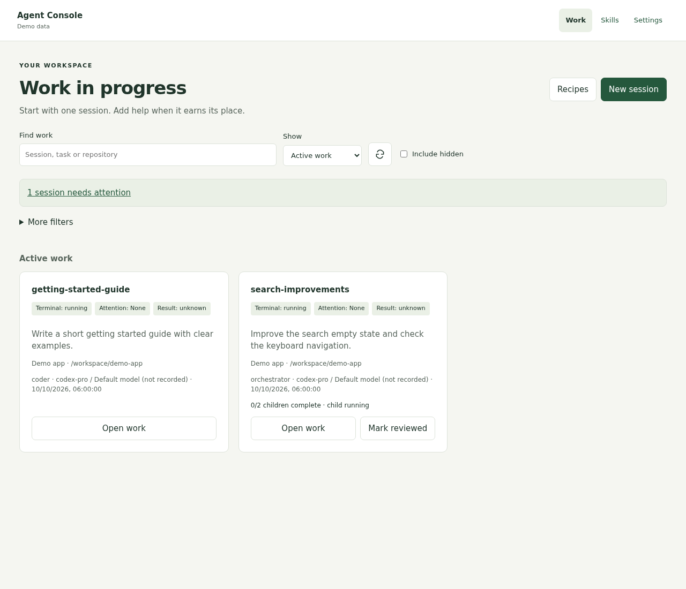
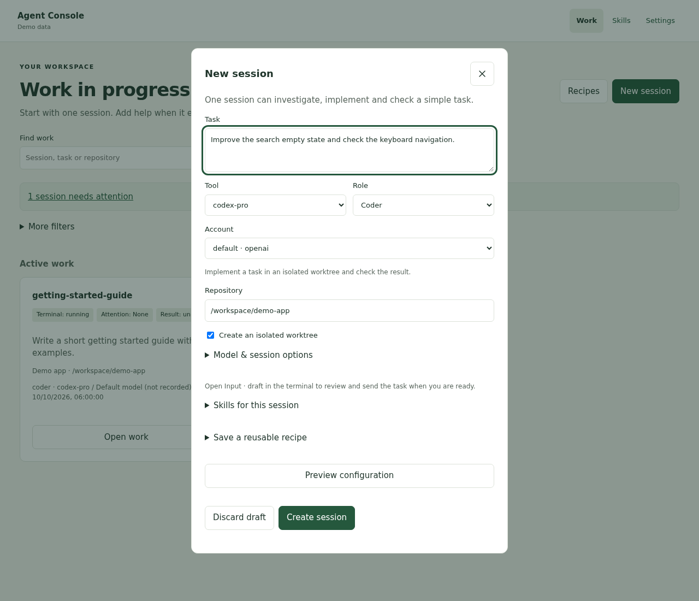
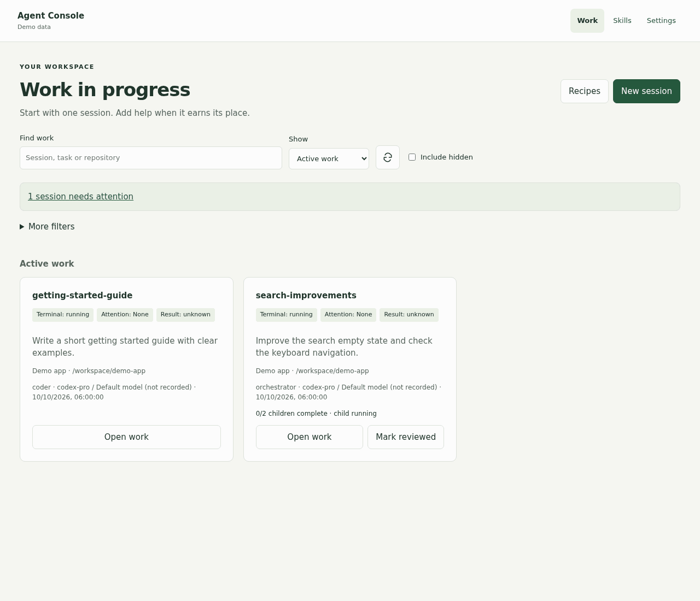
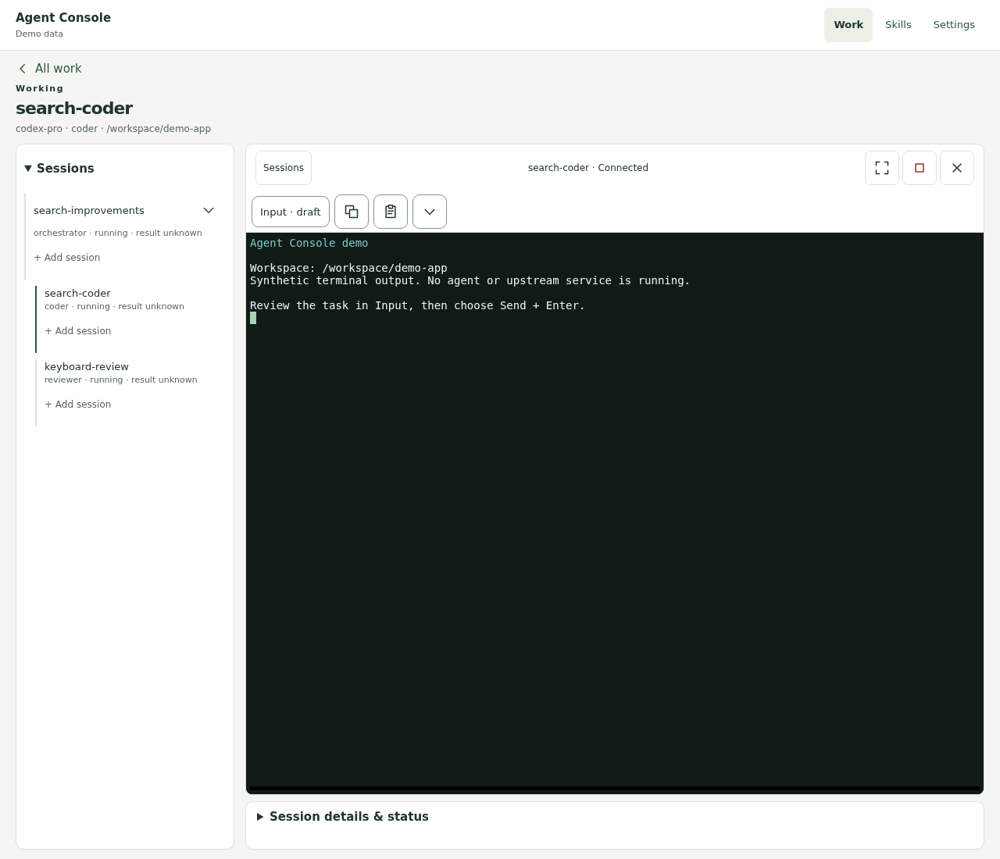
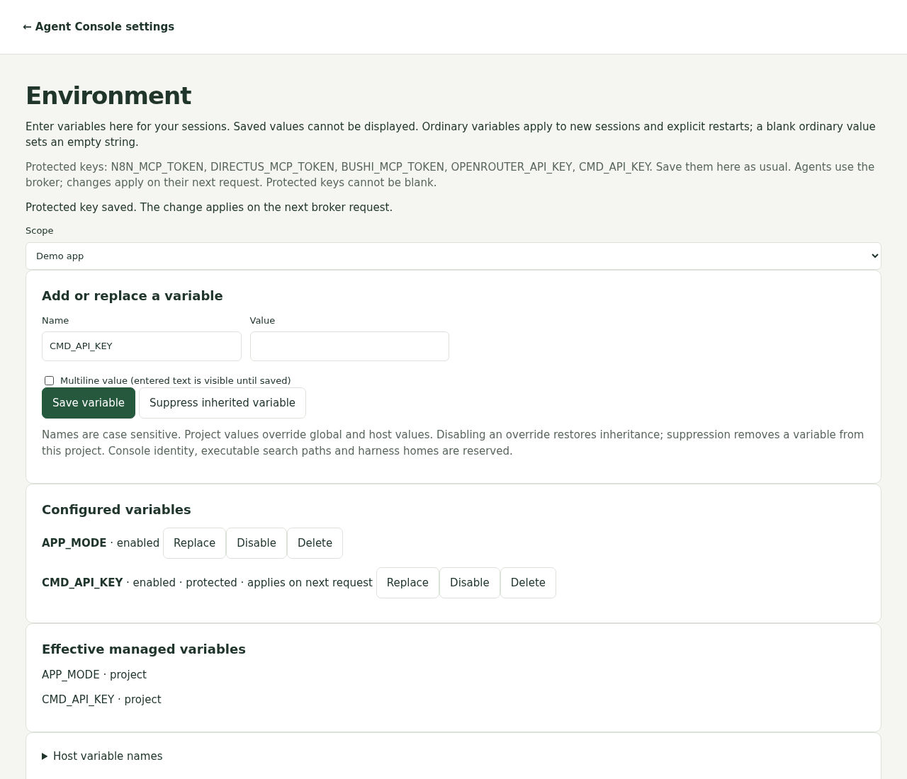
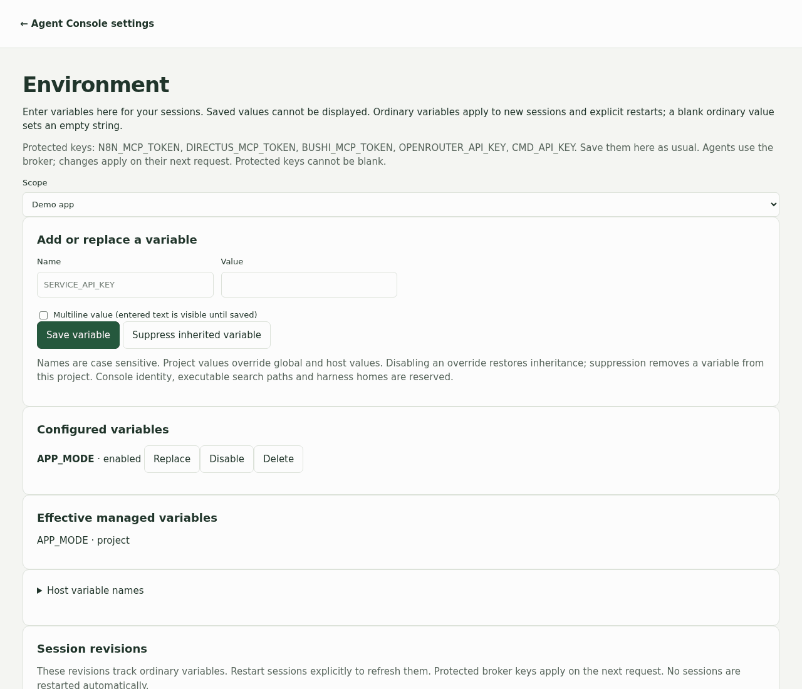

# Agent Console

Agent Console lets you run AI coding tools in a browser and keep related work together. Each session has its own conversation and terminal. You can use one session for a small task, or add a coder, reviewer or other helper when the work needs it.

It supports Codex, Codex Pro, Claude, OpenCode, Pi, Hermes and a plain shell, depending on what is installed and configured on your host. The tools run in tmux, so closing a browser tab does not stop them.



*All screenshots and animations use demo data. No real conversations or credentials are shown.*

## Install and open

For the Linux user-service installation, you need Python 3.11 or newer, Node.js 18 or newer, npm, Git, tmux and a working systemd user service manager. Install and sign in to the AI tools you want to use on that host.

```bash
git clone https://github.com/Fadekyun/agent-console.git
cd agent-console
export AGENT_CONSOLE_TAILSCALE_LOGIN=your-email@example.com
./scripts/install.sh
agentctl doctor
```

Open **http://127.0.0.1:3210/work** on that machine. From another machine, forward the port with SSH:

```bash
ssh -L 3210:127.0.0.1:3210 your-user@your-server
```

Then open the same URL in your local browser. The default service listens on localhost. Configure the trusted host and network settings before enabling direct LAN or proxy access; see [security and access](docs/security.md) and [operations](docs/operations.md).

The installer sets up the Python environment, browser assets, CLI wrappers and web service. It does not install or authenticate every AI tool for you. Check **Settings → Tools & accounts** if a tool is unavailable.

## Start your first task

1. Open **Work** and choose **New session**.
2. Write what the session should accomplish. Choose a tool, role and account.
3. Enter the repository path on the server. For code changes, keep **Create an isolated worktree** selected so the session has a separate working copy.
4. Choose **Create session**. The terminal opens with your task saved as a draft.
5. Open **Input · draft**, review the text, then choose **Send + Enter** to start the task.





*Static alternative: the [new session form](docs/media/new-session.png) shows the settings. After creation, open Input and choose Send + Enter.*

**Send** pastes text into the terminal; **Send + Enter** also submits it. Closing the terminal view leaves the session running. Use its session controls when you want to interrupt, restart or stop it.

The Work page keeps terminal state, attention and results separate. A running terminal does not prove that the task is finished. **Needs review** means the session has asked you to check its work.

## Work with more than one session

Open a session and choose **+ Add session** to put a helper beneath it. Give the helper a focused task, such as reviewing the changed files or checking keyboard navigation. Each helper gets its own terminal and conversation.



The tree groups related work. A tree link does not send a task, share conversation memory or make one session wait for another. A manually added session starts immediately; review and send its task draft when ready. Scheduling is optional and has its own controls.

Managed sessions can inspect and control related interactive sessions in the same tree, including parents and siblings. Repository editing permissions still come from their role and mode. Other trees cannot be controlled through a session credential. See [session capabilities](docs/SESSION_CAPABILITIES.md) for command details and restrictions.

Choose a role that matches the task:

| Role | Use it for |
| --- | --- |
| General | Ordinary interactive work |
| Coder / Bugfix | Implementing a change or fixing a reproducible problem |
| Planner / Scout / Researcher | Planning, tracing the repository or researching before changes |
| Reviewer / Verifier | Reading changes and checking the requested result |
| Orchestrator | Dividing useful work between sessions and checking their reports |
| Release | Preparing and carrying out an explicitly authorized release |

A role supplies instructions and permissions. A **skill** supplies reusable guidance for a particular task. Open **Skills** to manage the library, or expand **Skills for this session** before creating a session to check what will be selected. Changes to skill assignments apply to future launches or explicit restarts; they do not rewrite an active conversation's copy. See [skill management](docs/SKILL_REGISTRY.md) and [delivery details](docs/skill-delivery-audit.md).

## Add environment variables and keys

Open **Settings → Manage environment variables**. Choose **Global defaults** or a project, enter the variable name and value, then choose **Save variable**. Saved values cannot be displayed; use **Replace** to enter a new one.



Project values apply to sessions assigned to that project. Use the Project field in **Settings → More controls → Open full control panel** when creating one; choosing a repository alone does not assign a project. Children inherit their parent's project.

Project values override global values, which override selected-account defaults and inherited host values. **Disable** or **Delete** removes that override and restores any inherited value. **Suppress inherited variable** removes access to that variable for the chosen project. Ordinary variables take effect when you create a session or explicitly restart it.

After the host operator enables the broker, these five names use protected storage:

| Name | Used for |
| --- | --- |
| `N8N_MCP_TOKEN` | n8n tools |
| `DIRECTUS_MCP_TOKEN` | Directus tools |
| `BUSHI_MCP_TOKEN` | Bushi tools |
| `OPENROUTER_API_KEY` | OpenRouter tools and models |
| `CMD_API_KEY` | CommandCode models, including configured Pi and Hermes sessions |

The form stays the same. A separate local broker stores these keys and adds them to requests to the configured service. Connected agents receive a broker credential instead of the upstream key. Updates apply on the next request in sessions using the broker; you do not need to restart those sessions for a key replacement.



*Static alternative: the [Environment screenshot](docs/media/environment.png) shows the saved protected variable. The value clears after saving.*

The broker is optional and must be configured by the host operator before protected connections work. Until it is enabled, the existing environment behavior stays in place. A fresh Pi or Hermes account also needs the [one-time model catalogue setup](docs/CREDENTIAL_BROKER.md#set-up-a-fresh-pi-or-hermes-account). A broker outage is reported as a connection failure. Existing credentials and running sessions are not migrated automatically. See [broker setup](docs/CREDENTIAL_BROKER.md) and [Environment behavior](docs/ENVIRONMENT.md) for setup, scope rules and deployment details.

## Common problems

| What you see | What to check |
| --- | --- |
| A tool is unavailable | Open Settings → Tools & accounts, then run `agentctl doctor` on the host. Check that the tool is installed and its selected account is ready. |
| The session opened but has not started the task | Open Input and send the draft with **Send + Enter**. |
| The terminal disconnected | Reopen or reconnect the terminal. Check the session state before restarting it. |
| A normal environment change has not appeared | Explicitly restart the affected session when you are ready. |
| A protected connection fails | Check the broker service, its fixed upstream configuration and the key's scope. |
| A session cannot control another session | Check that both belong to the same tree and that the target is a managed interactive session. |

Useful host commands:

```bash
agentctl doctor
agentctl session list
agentctl session inspect SESSION_NAME
agentctl session review SESSION_NAME
agentctl profile list
agentctl skills doctor
```

Session inspection reads stored metadata and available live observations. An unavailable observation is reported as unknown; it is not proof that a session stopped. Stopping a session does not delete its worktree or branch.

## Administration and development

The web service, CLI and SSH selector use the same application layer. tmux holds live terminals; SQLite stores session metadata. Use separate Unix users for separate installations: changing only the port does not isolate service units, CLI links or tmux sockets.

For an existing Git installation, the guarded update command is `scripts/update.sh <approved-main-sha>`. It checks the selected revision, takes backups and validates health and session inventory. The installer preserves existing runtime settings when merging its defaults. Read the [maintenance guide](docs/platform-maintenance.md) before updating or rolling back.

- [Documentation index](docs/README.md)
- [Operations and recovery](docs/operations.md) · [Recovery guide](docs/recovery.md)
- [Optional compute queue and host admission](docs/COMPUTE_SCHEDULING.md)
- [Security and authentication](docs/security.md) · [Accounts](docs/auth-contexts.md)
- [Pi and Hermes model setup](docs/PI_HERMES_COMMANDCODE.md)
- [CLI entrypoints](docs/selected-release-entrypoints.md) · [Architecture](docs/architecture.md)
- [Roadmap](docs/DEVELOPMENT_ROADMAP.md) · [Release notes](docs/RELEASE_NOTES.md)
- [Contribution rules](AGENTS.md) · [Recreate the README media](docs/media/README.md)

The source includes Docker Compose support. The image does not bundle AI coding tools; install the tools and their authentication inside the container if you use that path. The native installation above is the direct route for tools already configured on the host.

MIT licensed. See [LICENSE](LICENSE).
