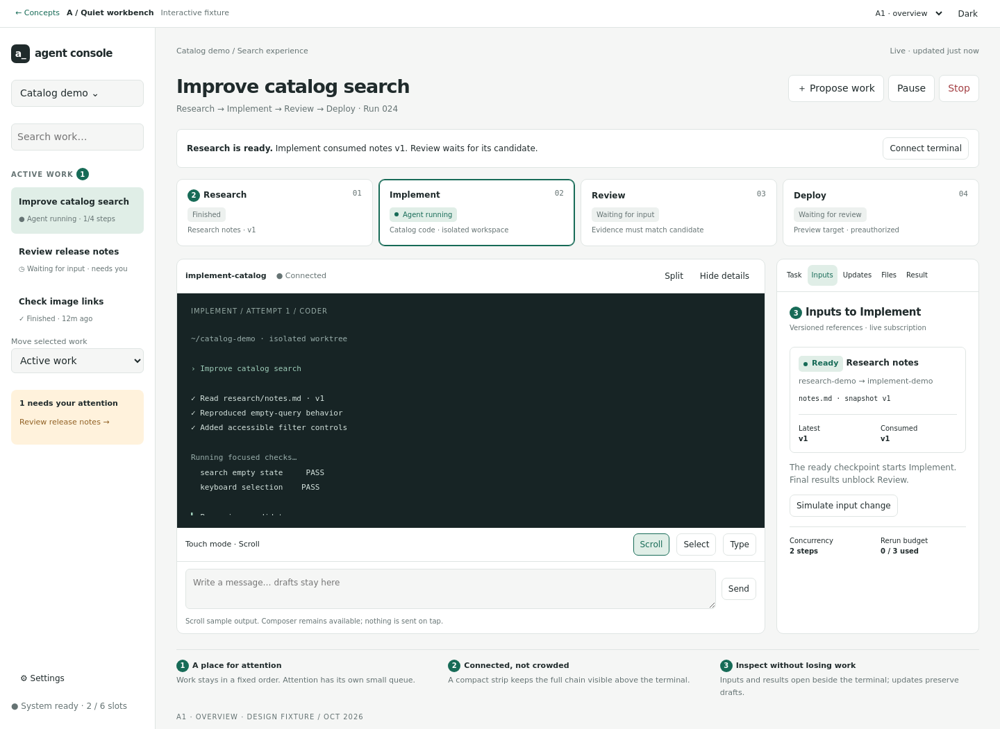
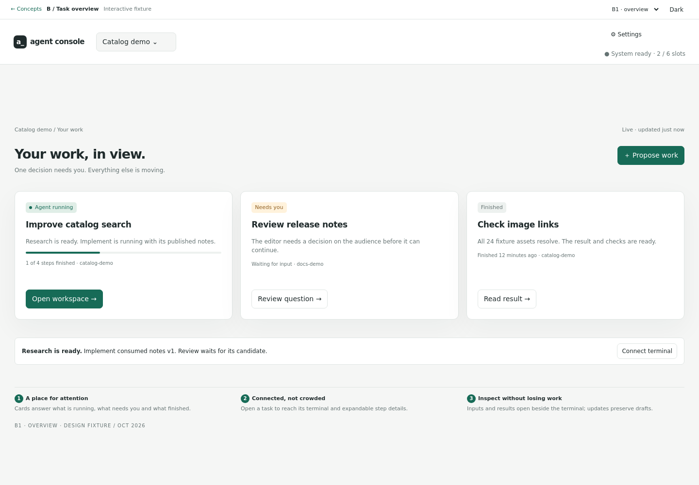

# Agent Console design review · 01 October 2026

Two alternatives for the same connected terminal workflow. **Design review only; application implementation starts after the operator chooses or revises a concept.** All visible repositories, sessions, files, commits and messages are fictional fixtures.

- **A — Quiet workbench (recommended):** keep the terminal central, with a stable work list, compact dependency strip and collapsible inspector.
- **B — Task overview:** lead with active, waiting and completed work cards; open a task to reach a terminal workspace with expandable steps.

## Open the clickable prototypes

Download this directory (or the repository ZIP), extract it and open **[index.html](index.html)** in a browser. No server, account, package installation or network connection is required. Individual entry points: [A](a.html), [B](b.html). GitHub displays HTML source rather than running it; download before opening. `prototypes.zip` contains this complete review directory, including both prototypes and the annotated frames.

Use the frame picker to switch between overview, connected work, changed input and phone scenarios. Resize the browser to 390px for the phone layout. The Light/Dark button is available in both concepts.

Try this sequence in each concept:

1. **Propose work → Edit proposal.** Change the title or release target, then save. Review required inputs, outputs, agent roles and permitted actions.
2. **Start listed steps.** The reviewed scope is frozen for this fixture run. Inspect **Task** to see that scope.
3. **Inputs → Simulate input change.** Research publishes a new version; the active implementation becomes stale and its review no longer permits release.
4. **Updates → Deliver at boundary.** Delivery changes to Yes while consumption stays on the previous version.
5. **Pause → Finish attempt → Resume.** Active work can finish during a pause; the replacement starts only after Resume and consumes the latest input version.
6. **Connect terminal.** A supported existing session connects without restart. Selecting the legacy harness exposes “setup required” and disables connection.
7. **Updates → Simulate failure → Retry delivery.** The message remains available for retry. The fixture explains reuse of the delivery identity.
8. On phone, use **Scroll / Select / Type**; tap Type to focus the draft composer. Tap the output in Scroll mode without switching to typing.

The prototype does not run an agent, scheduler, shell, merge or deployment. It illustrates the intended state transitions. Reloading resets fixtures; storage durability and real terminal behavior are implementation acceptance gates, not claims about this static page.

## Annotated frames

The first digit is the concept's frame number. The same fictional task and input versions are used in both directions. B3 also demonstrates the dark theme.

| Frame | A · Quiet workbench | B · Task overview | Review focus |
|---|---|---|---|
| 1 | [A1 overview](frames/A1-overview.png) | [B1 overview](frames/B1-overview.png) | Active work, attention, finished work and stable order |
| 2 | [A2 connected](frames/A2-connected.png) | [B2 connected](frames/B2-connected.png) | Four-step chain, two terminals and versioned inputs |
| 3 | [A3 changed](frames/A3-changed.png) | [B3 changed](frames/B3-changed.png) | Queued update, one replacement, invalidated review |
| 4 | [A4 phone](frames/A4-phone.png) | [B4 phone](frames/B4-phone.png) | Attention, result review and explicit terminal modes |

### A1 · Quiet workbench


### B1 · Task overview


## Decisions requested

Please respond by frame ID (for example, “A2: move the inputs below the terminal”).

- Choose A, B, or specify the parts to combine.
- Are navigation, terminal size and phone review priorities right?
- Are any controls missing or any statuses unclear?
- Is the proposed handoff behavior right: visible updates at safe boundaries, attachment without restart and automatic downstream recomputation?
- Confirm or change the proposed limits: two concurrent workflow steps and three automatic reruns per step per run.

Choosing a visual direction does not itself deploy it. The follow-on implementation plan must retain the agreed run authorization, release evidence and recovery behavior.

## Acceptance and validation

Checked for this design package:

- [x] Two distinct layouts with identical fixture data and a complete four-step workflow.
- [x] Eight annotated PNG frames, including phone views and a dark-theme example.
- [x] Proposal → edit → Start → inspect inputs → pause → resume works in both concepts.
- [x] Input changes invalidate prior review and coalesce into one replacement.
- [x] Delivery and consumption are displayed separately; unsupported harness attachment is disabled.
- [x] Visible failure/retry, Stop, pending update and result states.
- [x] Draft text, focus, selection, output scroll and stable work ordering survive a simulated update.
- [x] Keyboard controls, group movement without drag, and explicit touch input modes.
- [x] No horizontal overflow at 1440px, 1024px or 390px in light and dark themes.
- [x] Chromium fixture checks report no JavaScript errors or HTTP(S) requests.

See [verification.json](verification.json) for browser version, checks and frame filenames. These checks exercise the static design; they do not validate production xterm, clipboard integration, persistence, launch idempotency or authorization enforcement.

Reproduce screenshots and checks with Playwright 1.49.1 / Chromium 131 (or a locally installed compatible browser):

```sh
PLAYWRIGHT_MODULE=/path/to/playwright \
CHROMIUM_PATH=/path/to/chromium \
node docs/design/connected-work-20261001/verify.cjs
```

## Resume point and boundaries

The September 21 branch `agent/console-ui-rework-20260921` at `14fd8bf` is preserved. Its work includes stable session ordering, last activity, session areas and mobile/clipboard behavior. The inherited planning review identified unresolved touch scrolling, group movement and refresh/draft defects; reuse its useful behavior and tests, but retest those paths before application integration.

This design branch starts at `dc29ccdd1b7e6bfca84377a7c07c6b3f022b5af2`, and adds only this review directory. It does not merge the September branch. No runtime source, version, schema, service or configuration changes are included, and this branch is not proposed for merging to main. A later application PR must follow repository version, roadmap, release-note and one-issue rules.

Ownership: [#90 UI](https://github.com/Fadekyun/agent-console/issues/90), [#87 results/handoffs](https://github.com/Fadekyun/agent-console/issues/87), [#121 cross-session messaging](https://github.com/Fadekyun/agent-console/issues/121), [#86 orchestration](https://github.com/Fadekyun/agent-console/issues/86). The linked workflow issue coordinates these capabilities; it must not duplicate their storage or messaging implementations.

[Connected-work semantics, proposed contracts and implementation gates →](workflow.md)
