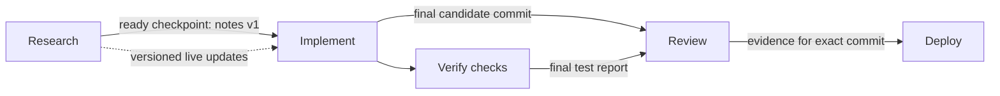

# Connected terminal workflows: live handoffs and automatic recomputation

Design proposal for review alongside UI issue #90. This document specifies future behavior; no backend interfaces below exist as a result of this design package.

## Operator contract

An agent proposes a graph of steps. The operator edits it, reviews the exact tasks, repositories, input subscriptions, expected outputs, agent configurations, targets and permitted actions, then presses **Start**. Start authorizes those listed actions once, including merge and deployment when explicitly listed. There is no repeated confirmation for actions already included. Adding a step, changing a release target or expanding permissions creates a new definition revision for review.

The interface uses notebook concepts (inputs, versioned outputs, attempts and history) inside a terminal workspace. It does not require a node canvas. Ordered step controls must have keyboard and touch alternatives to dragging.

## Data flow

The four-step UI fixture folds checks into Implement. The diagram makes the shared join rule explicit: Review waits for every required input, including the candidate and tests. Independent branches can continue when another branch is blocked.

| Object | Proposed contents and invariant |
|---|---|
| Work definition | Durable ID, revision, project/repo, ordered DAG, step tasks/configuration, dependency readiness conditions, selected file references, permitted actions/targets, limits. Reject cycles and ambiguous joins before Start. |
| Run | Definition revision and authorization snapshot, state, concurrency/rerun limits, operator identity, event cursor. Definition is immutable for the run. |
| Step attempt | Attempt ID/number, durable session ID, exact input version set, launch receipt/idempotency key, start/finish state, stale flag and reason. Keep prior attempts. |
| Result/checkpoint | Producer attempt, sequence/version, ready versus final, summary, artifact/commit references, publication time. Conversation text alone is not a ready signal. |
| Artifact | Selected snapshot or commit, digest, origin, version, safe display metadata. Never a pointer to an unrestricted mutable work directory. |
| Inbox delivery | Source/destination IDs, message ID/sequence, input version, queued/delivered/consumed status, acknowledgments, retry/error state. Delivery is not consumption. |
| Review evidence | Reviewer attempt, candidate commit, required checks and verdict, invalidation reason. A review of one commit never approves another. |
| Release receipt | Exact authorized target, candidate, operation identity, before/after observation and outcome; reconcile uncertain outcomes before retry. |

## Existing terminals and harnesses

Attach by durable session ID without restarting its process or clearing history. Preserve the session's repository and role constraints. A connection cannot grant capabilities the harness or session role lacks.

Adapters explicitly advertise unattended start, safe input delivery, structured output/checkpoints, interrupt and recovery support. The UI shows **setup required** when a capability is absent. Enable automatic mode only after the adapter passes conformance checks; do not send keystrokes to a busy terminal as an input-delivery substitute.

A durable inbox makes live conversation updates visible, source-attributed and ordered. Deliver meaningful updates at supported safe turn boundaries. Deduplicate delivery and acknowledgment after reconnects. Store the exact input set the attempt consumes, independently of delivery success.

## Readiness, stale attempts and recomputation

- A ready checkpoint may unblock a dependency explicitly configured for early start.
- A final-result dependency waits for final completion. All required inputs of a join must be ready; a failed prerequisite blocks its dependents.
- File subscriptions refer to selected snapshots or commits. Each coder writes in an isolated worktree; it never edits the producer's working directory concurrently.
- A meaningful subscribed input change marks affected downstream attempts stale and invalidates dependent review evidence.
- Combine updates received while an attempt is running. Let that attempt finish, retain its output as stale, then dispatch one replacement with the newest complete input set.
- A paused run may finish active attempts, but cannot dispatch replacements until resumed.
- Default proposal: two simultaneous steps within the existing global session cap; at most three automatic recomputations per step per run. On exhaustion, stop automatic scheduling and display what changed and which limit was reached.
- Failure and retries stay visible. A retry keeps the operation identity when retrying delivery; a new step execution has a new attempt ID.
- Do not expose stale artifacts as current results. History remains inspectable.

## Release and recovery

Release eligibility requires explicit Start authorization for the action and target, an exact candidate commit, matching non-stale review evidence, and configured checks passing. Changed code invalidates pending release eligibility. An already-completed external release is not silently rolled back by a later upstream change.

Persist launch receipts before treating a launch as complete. Use deterministic launch keys and reconcile actual sessions after service recovery to prevent duplicate launches. Browser disconnects do not control the scheduler. Shared resource and session limits are enforced at dispatch.

For an interrupted external operation, observe the target first. If the outcome is uncertain, display reconciliation required and block its retry; do not repeat a merge/deploy because a response was lost.

**Pause** stops new dispatches while active attempts continue. **Stop** interrupts active attempts and cancels queued work, preserving outputs and history. Resuming a stopped run requires an explicit new run decision; Pause and Stop must not be conflated.

## Proposed shared API and CLI surface

Names are illustrative and must be reconciled with #86, #87 and #121 during implementation.

| Intent | Authenticated API concept | Matching `agentctl` concept |
|---|---|---|
| Propose/edit graph | Create/read/update definition revision | `work propose`, `work edit`, `work show` |
| Start authorized revision | Start run with revision + authorization snapshot | `work start` |
| Inspect attempts/history | Read run/step attempts and exact inputs | `work inspect`, `work history` |
| Attach existing session | Bind durable session ID after capability check | `work connect` |
| Publish ready/final output | Result and artifact publication owned by #87 | `result publish` |
| Deliver/acknowledge | Durable inbox contract owned by #121 | `inbox list`, `inbox ack` |
| Pause/resume/stop | Explicit run control transitions | `work pause`, `work resume`, `work stop` |
| Observe/recover | Resumable event cursor, deduplicated history | `work events --after` |

Return stable object identifiers, revision/version conflicts, launch receipts and actionable capability errors. API/CLI authorization must be identical. Use existing terminal WebSockets for terminal traffic; internal status events must not steal terminal focus or overwhelm terminal traffic. Do not implement a second inbox/results store in the workflow coordinator.

## Delivery order after design approval

1. **Shared responsive UI and reliability:** choose/revise concept, stable updates and ordering, preserve drafts/focus/selection/scroll, keyboard grouping, touch modes, clipboard fallback. Reuse and verify relevant September branch tests.
2. **Results, inbox and adapters:** #87 owns results/artifacts; #121 owns durable messages/acknowledgments; add harness conformance and preserved-session attachment.
3. **Workflow scheduler and recomputation:** #86 orchestration integration, DAG validation, readiness, persisted attempts, joins, stale propagation, coalescing, limits and recovery.
4. **Release integration:** match review evidence to commit, frozen authorization scope, reconcile external outcomes. Preserve host configuration affected by #127 when deploying later.

Each application slice needs a bounded issue/PR, relevant tests, migration/rollback coverage where storage changes, version/release-note/roadmap updates and explicit release authorization. The design package itself changes no runtime or schema.

## Implementation acceptance gates

- Existing processes and history survive attachment, UI navigation and service recovery.
- Updates preserve draft text, focus, selection and scroll, with stable list ordering unless the operator explicitly changes it.
- Inputs, outputs and messages survive restart, with no duplicate launch or input application.
- Branches, joins, failed prerequisites, unavailable adapters and bounded limits display correctly.
- Multiple upstream changes coalesce into one replacement consuming the latest complete version set.
- Prior attempts and snapshots remain inspectable; stale review cannot release newer code.
- Pause, Stop, browser disconnect and scheduler recovery produce the specified behavior.
- Real desktop, narrow desktop and phone tests cover touch scrolling/selection/typing, clipboard permissions/fallback, keyboard controls, pending/errors/retries and safe focus behavior.
- Storage migration and rollback preserve existing sessions and host configuration.

Open for design feedback: layout preference, phone priorities, step and input presentation, and the proposed concurrency/rerun defaults. Real harness behavior, scheduler persistence, performance and release safety require implementation evidence after approval.
